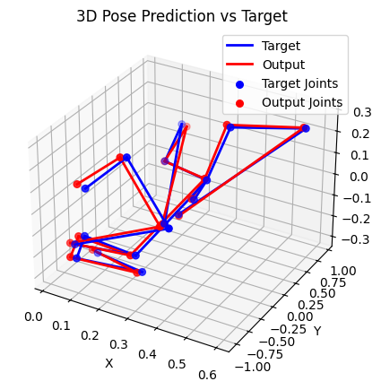

# Stochastic Process을 이용한 pose prediction

동작들에 대해서 고유값을 이용해서 대략적인 분석이 가능한 상태임  
여기에다가 text를 이용해서 내가 원하는 동작을 만들어보고자 함  
e.g) 더킹 이후에 훅과 같은 동작을 point cloud로 만들고자 함  

다음과 같은 목표를 가지고 있음  

1. 모델을 이용한 데이터 분석
2. 내가 원하는 동작에 대해서 frame 별로 만드는 것 대신에 모델링을 통해서 빠르게 만들 수 있음 -> 나중에 격투게임을 만들때 편할 것 같음

### 구조
하나의 동작에 대해서 Stochastic Process를 따른다고 가정을 함  
펀치를 날릴때 다리의 움직임을 통해서 위치를 잡은 이후에 발로 지면을 밀어내는 반발력을 받아서 허리 회전을 통한 상체의 힘의 전달이 이루어지고 이를 주먹으로 상대에게 보내줌  
일련의 Stochastic Process의 filtration의 개념이 들어가는 것 같음  
정확히는 아니지만 어렴풋이 아래 그림과 같이 나타날 것 같음  

위 가정에 따르면 동영상의 frame에 대해서 특징을 추출이 가능하고 이는 확률과정을 따를 것임  
이후에 text를 이용해서 확률과정의 path를 결정을 하고 이후에 path에 대응되는 frame을 생성을 함  

### 옛날 아이디어
text 정보를 이용해서 신체 부분(팔/다리)에 대해서 회전/이동을 생각하고 싶음  
하지만 이를 위해서는 신체 부분을 어떤 기준으로 분할을 해서 각 부분에 대한 연산으로 바꿀지 고민을 해봐도 좋은 아이디어가 떠오르지 않음  
부분을 선택해서 연산을 한다면 신경망을 이용한 예측을 하는 것 보다는 계산량을 적게 할 수 있을 것 같은데 모르겠음 

### 추가
이거 잘 동작하면 확률과정을 바꿔서 다른 신경망 모델을 이용할 수 있을 것 같음  
실제 스파링 상황을 생각을 한다면 특징을 빠르게 파악하고 빠르게 대응을 할 수 있어야 함 -> 계산량을 줄일 필요가 있음  

### MLP
테스트용도로 joint에 대해서 MLP을 이용한 예측을 진행을 함   
데이터로더를 i번째 joint vector에 대해서 i+1번째의 joint vector를 예측을 하도록 구성을 함  
이후에 MLP를 이용해서 예측을 했는데 예측은 어느정도 잘하는 걸로 보임  

하지만 이는 인접한 프레임에 대해서 변화량이 얼마 없어서 그런 것일 수 있고  
추가적으로 데이터를 많이 확보하지 못해서 overfitting일 수 있음  

1. 추가적인 데이터 수집
2. 데이터 로더를 구성을 할 때 (i,j)까지의 vector들을 input으로 받고 임의의 길이만 큼 i-k , j+k의 벡터들을 예측하도록 변경  
미래의 동작을 예측을 하는 것도 중요하지만 반복되는 동작이 있다고 가정을 한다면 이전의 프레임을 예측을 하는것도 학습을 하는데 좋은 방향이 될 것 같음 
